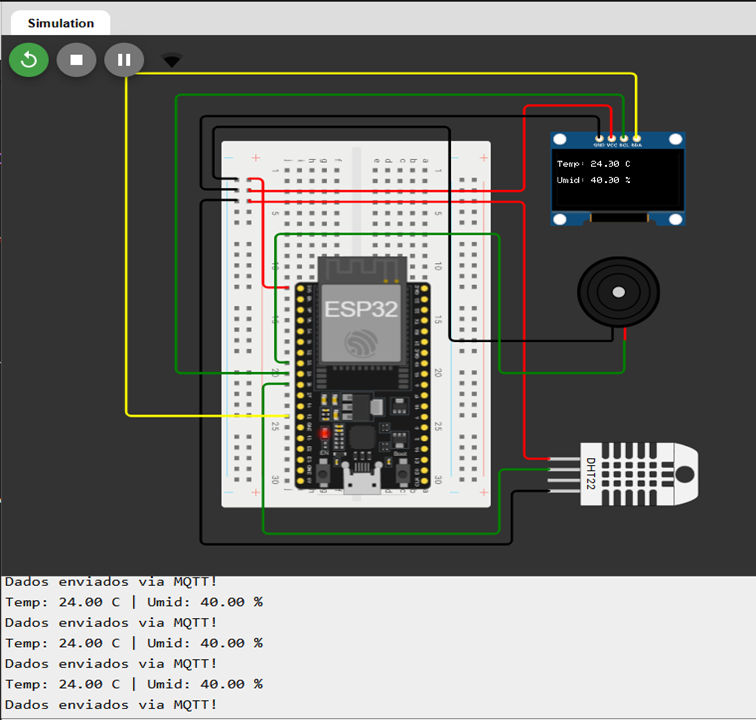
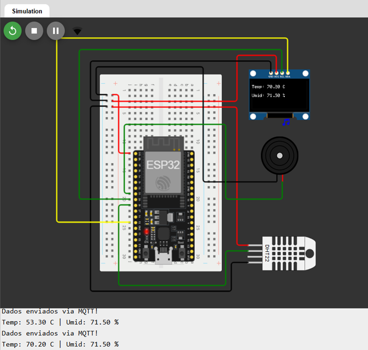
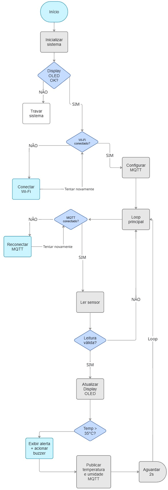

# Sistema IoT de Monitoramento Ambiental com ESP32

Sistema IoT de monitoramento ambiental em tempo real desenvolvido utilizando a plataforma ESP32, sensor DHT11, display OLED, buzzer e protocolo MQTT para coleta, processamento, exibição local e transmissão remota de dados de temperatura e umidade.

Este projeto foi desenvolvido como atividade acadêmica da disciplina **Objetos Inteligentes Conectados**, da **Universidade Presbiteriana Mackenzie**, com o objetivo de aplicar conceitos de Internet das Coisas (IoT), sistemas embarcados, comunicação MQTT e monitoramento remoto em tempo real.

## Desenvolvedores

* Gabriel Da Silva – RA: 10441447
* Heitor José Da Silva – RA: 10441449

---

# Objetivo do Projeto

Desenvolver um sistema inteligente capaz de monitorar continuamente as condições ambientais de um ambiente por meio da medição de temperatura e umidade, disponibilizando essas informações localmente e remotamente através da internet.

O sistema foi projetado para:

* Coletar dados ambientais em tempo real;
* Exibir as informações localmente em um display OLED;
* Transmitir os dados remotamente utilizando MQTT;
* Permitir acompanhamento em dispositivos móveis e computadores;
* Emitir alertas sonoros quando temperaturas elevadas forem detectadas;
* Demonstrar a aplicação prática dos conceitos de Internet das Coisas.

---

# Tecnologias Utilizadas

* ESP32
* MQTT
* Wi-Fi
* HiveMQ Broker
* IoT MQTT Panel
* Arduino IDE
* Display OLED SSD1306
* Sensor DHT11
* Buzzer
* Protoboard
* Estrutura física em MDF

---

# Arquitetura do Sistema

A figura abaixo apresenta a arquitetura física do sistema em condição normal de operação, incluindo o ESP32, sensor DHT11, display OLED e buzzer.



Quando a temperatura ultrapassa o limite configurado de 35°C, o buzzer é acionado automaticamente para alertar sobre a condição crítica identificada pelo sistema.



---

# Componentes Utilizados

| Componente | Função |
|------------|---------|
| ESP32 Dev Module | Processamento e comunicação |
| DHT11 | Leitura de temperatura e umidade |
| OLED SSD1306 | Exibição local das informações |
| Buzzer | Alerta sonoro |
| Protoboard | Montagem do circuito |
| Jumpers | Interligação elétrica |
| Cabo USB | Alimentação e gravação |
| Estrutura MDF | Suporte físico do sistema |

---

# Ligações do Circuito

## Sensor DHT11

| DHT11 | ESP32 |
|--------|--------|
| VCC | 3.3V |
| GND | GND |
| DATA | GPIO 19 |

---

## Display OLED SSD1306 (I2C)

| OLED | ESP32 |
|--------|--------|
| VCC | 3.3V |
| GND | GND |
| SDA | GPIO 21 |
| SCL | GPIO 22 |

---

## Buzzer

| Buzzer | ESP32 |
|---------|---------|
| Positivo | GPIO 18 |
| Negativo | GND |

---

# Bibliotecas Utilizadas

```cpp
#include <WiFi.h>
#include <PubSubClient.h>
#include <Wire.h>
#include <Adafruit_GFX.h>
#include <Adafruit_SSD1306.h>
#include "DHTesp.h"
```

## Função de cada biblioteca

### WiFi.h

Responsável pela conexão do ESP32 à rede Wi-Fi.

### PubSubClient.h

Implementa a comunicação MQTT entre o ESP32 e o broker.

### Wire.h

Controla a comunicação I2C utilizada pelo display OLED.

### Adafruit_GFX.h

Biblioteca gráfica utilizada para renderização de textos.

### Adafruit_SSD1306.h

Biblioteca responsável pelo controle do display OLED SSD1306.

### DHTesp.h

Biblioteca utilizada para leitura dos dados fornecidos pelo sensor DHT11.

---

# Configuração da Rede Wi-Fi

O sistema conecta-se automaticamente à rede configurada no código.

```cpp
const char* ssid = "";
const char* password = "";
```

O usuário deve inserir o nome da rede Wi-Fi e a senha correspondente para permitir a conexão do ESP32 à internet.

Após a conexão bem-sucedida, o ESP32 recebe um endereço IP e passa a ter acesso ao broker MQTT.

---

# Instalação

1. Instale a Arduino IDE.
2. Instale o pacote ESP32 pelo Board Manager.
3. Instale as bibliotecas:
   - WiFi
   - PubSubClient
   - DHTesp
   - Adafruit GFX
   - Adafruit SSD1306
4. Configure o SSID e a senha da rede Wi-Fi.
5. Conecte o ESP32 ao computador.
6. Compile e envie o código para a placa.

---

# Configuração MQTT

Broker utilizado:

```text
broker.hivemq.com
```

Porta:

```text
1883
```

Protocolo:

```text
TCP
```

Biblioteca MQTT:

```cpp
PubSubClient
```

---

# Tópicos MQTT Utilizados

## Temperatura

```text
adsobj/esp32/temperatura
```

## Umidade

```text
adsobj/esp32/umidade
```

Todos os dados coletados pelo ESP32 são publicados periodicamente nesses tópicos.

# Funcionamento do Sistema

## Inicialização

Ao ser energizado, o ESP32 executa as seguintes etapas:

1. Inicializa a comunicação serial.
2. Inicializa o sensor DHT11.
3. Inicializa o display OLED.
4. Configura o buzzer.
5. Conecta-se à rede Wi-Fi.
6. Conecta-se ao broker MQTT.
7. Inicia o monitoramento ambiental.

---

## Leitura dos Dados

O sensor DHT11 realiza a leitura periódica de:

- Temperatura (°C)
- Umidade relativa do ar (%)

Exemplo de leitura obtida durante os testes:

```text
Temperatura: 22.7 °C
Umidade: 75.4 %
```

Os valores variam conforme as condições do ambiente monitorado.

---

## Exibição Local

As informações são exibidas em tempo real no display OLED.

Exemplo:

```text
Temp: 22.7 C
Umid: 75.4 %
```

Caso seja detectada temperatura elevada, uma mensagem de alerta também é exibida.

---

## Publicação MQTT

Após cada leitura, os valores são convertidos para texto e enviados ao broker HiveMQ.

Exemplo:

```text
adsobj/esp32/temperatura
Temperatura: 22.70 C
```

```text
adsobj/esp32/umidade
Umidade: 75.40 %
```

Qualquer cliente MQTT inscrito nesses tópicos receberá automaticamente os dados publicados.

---

# Monitoramento Remoto

O sistema foi validado utilizando duas plataformas distintas.

## IoT MQTT Panel (Android)

Aplicativo utilizado para monitoramento remoto em dispositivos Android.

Disponível em:

https://play.google.com/store/apps/details?id=snr.lab.iotmqttpanel.prod

---

## HiveMQ WebSocket Client

Cliente MQTT utilizado em navegadores web.

Disponível em:

https://www.hivemq.com/demos/websocket-client/

---

# Sistema de Alerta

O sistema possui um mecanismo automático de alerta para temperaturas elevadas.

Quando a temperatura medida ultrapassa **35°C**, o ESP32:

- Exibe uma mensagem de alerta no display OLED;
- Aciona o buzzer;
- Continua transmitindo os dados normalmente via MQTT.

Trecho implementado:

```cpp
if(temp > 35){

    display.setCursor(0,50);
    display.println("!!! ALERTA !!!");

    tone(BUZZER_PIN,1000);

    delay(200);

    noTone(BUZZER_PIN);
}
```

---

# Fluxo de Funcionamento

A figura abaixo apresenta o fluxograma lógico de funcionamento do sistema desenvolvido, contemplando as etapas de inicialização, conexão Wi-Fi, comunicação MQTT, leitura do sensor DHT11, atualização do display OLED, acionamento do buzzer e publicação dos dados monitorados.



# Testes Realizados

## Teste de Tempo de Resposta do Sensor DHT11

Durante os testes, foi medido o tempo necessário para que os dados coletados pelo sensor fossem processados e disponibilizados pelo sistema.

| Medição | Tempo |
|----------|----------|
| 1 | 3,51 s |
| 2 | 5,72 s |
| 3 | 7,15 s |
| 4 | 13,67 s |

**Tempo médio: 7,51 segundos**

---

## Teste de Tempo de Resposta do Sistema de Alerta (Buzzer)

Também foi avaliado o tempo necessário para que o sistema identificasse a condição de alerta e acionasse o buzzer.

| Medição | Tempo |
|----------|----------|
| 1 | 4,96 s |
| 2 | 8,05 s |
| 3 | 9,86 s |
| 4 | 9,05 s |

**Tempo médio: 7,98 segundos**

---

# Estrutura Física

O protótipo foi montado sobre uma estrutura em MDF desenvolvida especificamente para acomodar os componentes eletrônicos do projeto.

A estrutura recebeu acabamento com pintura branca e foi projetada para:

- Fixação do ESP32;
- Organização dos cabos;
- Instalação do sensor DHT11;
- Instalação do display OLED;
- Instalação do buzzer;
- Melhor apresentação visual do sistema.

A utilização do suporte em MDF proporcionou maior estabilidade ao protótipo e facilitou a visualização dos componentes durante os testes e apresentações.

---

# Resultados Obtidos

O sistema apresentou funcionamento estável durante todos os testes realizados.

Foi possível:

- Monitorar temperatura e umidade em tempo real;
- Exibir dados localmente no display OLED;
- Publicar dados continuamente via MQTT;
- Monitorar remotamente em smartphone e computador;
- Acionar alertas sonoros automaticamente;
- Validar a comunicação IoT utilizando MQTT.

Durante os testes, o ESP32 manteve conexão estável com a rede Wi-Fi e com o broker HiveMQ, permitindo a transmissão contínua das informações coletadas pelo sensor DHT11.

A integração entre hardware e software ocorreu de forma satisfatória, demonstrando a viabilidade da utilização de sistemas embarcados para aplicações de monitoramento ambiental inteligente.

---

# Possíveis Melhorias Futuras

O projeto pode receber diversas melhorias e expansões futuras, tais como:

- Utilização de sensores mais precisos, como DHT22 ou BME280;
- Armazenamento dos dados em banco de dados local ou em nuvem;
- Desenvolvimento de dashboard web próprio;
- Implementação de comunicação MQTT segura utilizando TLS/SSL;
- Envio de notificações automáticas para dispositivos móveis;
- Criação de histórico de medições e geração de relatórios;
- Integração com plataformas de automação residencial;
- Alimentação por bateria recarregável ou energia solar;
- Controle remoto de atuadores através da internet.

---

# Repositório Acadêmico

Este projeto foi desenvolvido exclusivamente para fins educacionais e acadêmicos na disciplina **Objetos Inteligentes Conectados** da **Universidade Presbiteriana Mackenzie**.

O repositório disponibiliza o código-fonte completo do sistema, permitindo sua reprodução, estudo e futuras melhorias por outros estudantes e pesquisadores interessados em aplicações de Internet das Coisas.

Repositório:

https://github.com/heit0rz/esp32-iot-environment-monitor

---

# Licença

MIT License.

Este projeto é disponibilizado para fins educacionais, permitindo consulta, estudo e adaptação do código-fonte, desde que sejam mantidos os créditos aos autores originais.

---

## Desenvolvedores

**Gabriel Da Silva**  
RA: 10441447

**Heitor José Da Silva**  
RA: 10441449